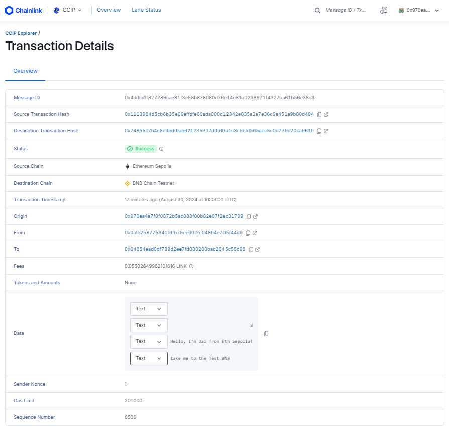

## Introduction to CCIP on Ethereum Sepolia to Test BNB Chain
> In dynamic world of decentralized finance, many blockchains are implementaing cross-chain communication and it's being game changer in market.

> [Chainlink Cross-Chain Interoperability Protocol (CCIP)](https://chain.link/cross-chain) is essential to have a strong understanding of this protocol and increase your skill in the blockchain world, and that's what we gonna look at below.

#### 🌐 What is Cross-Chain?

Cross-chain are mechanisms that design in such a way to increase interoperability between different blockchains by allowing different blockchain networks to communicate with each other and transfer data or value between each other.

Just as Web2 needs TCP/IP web3 needs interoperability standard.

### 💡 The CCIP protocol showcases several innovative features:
- You can transfer assets and information across multiple blockchains.
- Application developers can leverage the strengths and benefits of different chains.
- Collaboration between developers from diverse blockchain ecosystems enables the building of cross-chain applications to serve more users and provide additional features or products for them.

When it comes to security, CCIP sets the standard. It’s the only cross-chain solution offering cross-chain token transfers and messaging with comprehensive level-5 security—Defense-In-Depth which makes Metis more powerful.

## 🔧 CCIP: A Simple Implementation.

Sending data between smart contracts on different blockchains

This project demonstrates how Chainlink CCIP can be used to create a cross-chain basic simple data trasfer from Ethereum Sepolia to Test BNB Chain.

> BNB Chain have one supporting lane with Ethereum for mainnet and testnet.

## Prerequisites

- [Git](https://git-scm.com/book/en/v2/Getting-Started-Installing-Git)
- [Current LTS Node.js version](https://nodejs.org/en/about/releases/)

Verify installation by typing:

```shell
node -v
```

and

```shell
npm -v
```

## Getting Started

- Clone the github repository

```
git clone https://github.com/jaikumar9/CCIP_Data.git
cd CCIP_Data
```

- Install Dependencies

```
npm install
```
- Install Hardhat

```
npm install --save-dev hardhat
```

## What is Chainlink CCIP?

**Chainlink Cross-Chain Interoperability Protocol (CCIP)** provides a single, simple, and elegant interface through which dApps and web3 entrepreneurs can securely meet all their cross-chain needs, including token transfers and arbitrary messaging.


With Chainlink CCIP, one can:

- Transfer supported tokens
- Send messages (any data)
- Send messages and tokens

CCIP receiver can be:

- Smart contract that implements `CCIPReceiver.sol`
- EOA

**Note**: If you send a message and token(s) to EOA, only tokens will arrive

If you want to dive deep into it, check the [Official Chainlink Documentation](docs.chain.link).

## Usage

This guide shows you how to deploy a CCIP sender contract and a CCIP receiver contract to two different blockchains and send data from the sender contract to the receiver contract. You pay the CCIP fees using LINK as well as alternative assets, which currently include the native gas tokens of the source blockchain and their ERC20 wrapped version.

###Before we begin
If you are new for smart contract development, It is recommended to get familiar with necessary tools:

[Solidity Programming language](https://soliditylang.org/)
[remix](https://remix.ethereum.org/)
[Metamask wallet](https://metamask.io/)

We also need testnet tMetis and LINK tokens on Metis Sepolia neetwork. it also requires testnet ETH on Ethereum Sepolia.

- Install these dependencies

```shell
npm install --save @chainlink/contracts-ccip
```
- Set Up Hardhat 

```shell
npx hardhat
```
- Update .env file

```shell
PRIVATE_KEY=YOUR_PRIVATE_KEY
TBNB_RPC_URL="TBNB_RPC_URL"
ETHEREUM_SEPOLIA_RPC_URL="ETHEREUM_SEPOLIA_RPC"

```

- Make sure to have below configuration Hardhat for Metis and Sepolia

```shell
require('@nomiclabs/hardhat-waffle');
require('@nomiclabs/hardhat-ethers');
require("@nomicfoundation/hardhat-verify");
require('dotenv').config();

const PRIVATE_KEY = process.env.PRIVATE_KEY;
const ETHEREUM_SEPOLIA_RPC_URL = process.env.ETHEREUM_SEPOLIA_RPC_URL;
const TBNB_RPC_URL = process.env.TBNB_RPC_URL;
// const BSCSCAN_API_KEY = process.env.BSCSCAN_API_KEY;

const config = {
  solidity: "0.8.19",
  networks: {
    hardhat: {
      chainId: 31337,
    },
    ethereumSepolia: {
      url: ETHEREUM_SEPOLIA_RPC_URL || "",
      accounts: PRIVATE_KEY ? [PRIVATE_KEY] : [],
      chainId: 11155111,
    },
    tbnb: {
      url: TBNB_RPC_URL || "",
      accounts: PRIVATE_KEY ? [PRIVATE_KEY] : [],
      chainId: 97,
    },
  },
  typechain: {
    externalArtifacts: ["./abi/*.json"],
  },
  sourcify: {
    enabled: true
  },
  etherscan: {
    apiKey: {
      sepolia: process.env.ETHERSCAN_API_KEY,
      bscTestnet: process.env.BSCSCAN_API_KEY
    }
  },
};

module.exports = config;

```
- Compile Your Contracts
```shell
npx hardhat compile
```
- Deploy Your Contracts
```shell
npx hardhat run scripts/deploy_receiver.js --network tbnb
npx hardhat run scripts/deploy_sender.js --network ethereumSepolia
```
#### Don't forget to uddate Contract addresses in Tasks/sendMessages.js 
```shell
async function main() {
    const senderAddress = "0x0aFe258775341f9Fb75eED0F2C04894e705f44D9";   // Sender Address on Sepolia Ethereum
    const sender = await ethers.getContractAt("Sender", senderAddress);

    // Use ethers.BigNumber.from() to create a BigNumber
    const destinationChainSelector = ethers.BigNumber.from("13264668187771770619");
    const receiverAddress = "0x04654ead0dF789D2Ee7Fd080200bAc2645C55C98";   // Reciver Address on BNB Testnet
    const textToSend = "Hello, I'm Jai from Eth Sepolia! take me to the Test BNB";

    const tx = await sender.sendMessage(destinationChainSelector, receiverAddress, textToSend);
    await tx.wait();
    console.log(tx);
    console.log("Message sent with tx:", tx.hash);
}

```


#### This is what happening behind the schene.
1. Compiling the contracts.

2. Deployed the sender contract on Ethereum sepolia network:
	we pass router address 0x0BF3dE8c5D3e8A2B34D2BEeB17ABfCeBaf363A59 and LINK address 0x779877A7B0D9E8603169DdbD7836e478b4624789 for Ethereum Sepolia network. Find out more details for [Supported network](https://docs.chain.link/ccip/supported-networks) and [Link token contract](https://docs.chain.link/resources/link-token-contracts).

3. After we deploy receiver contract on Test BNB. For Test BNB, the Router address is 0xE1053aE1857476f36A3C62580FF9b016E8EE8F6f

Once you deploy the contract Open MetaMask and send 0.1 LINK to the sender contract address (Source contract address). Your contract will pay CCIP fees in LINK.

You now have one sender contract on Ethereum Sepolia Network and one receiver contract on BNB Test Network. You sent 0.1 LINK to the sender contract to pay the CCIP fees. Next, send data from the sender contract to the receiver contract.


#### Send data 
```shell
npx hardhat run tasks/sendMessage.js --network ethereumSepolia
```
After the transaction is successful, note the transaction hash. Here is an example of a successful transaction on Both The Source and Destination chains.

After the transaction is finalized on the source chain, it will take a few minutes for CCIP to deliver the data to BNB Test Chain and call the ccipReceive function on your receiver contract. You can use the [CCIP explorer](https://ccip.chain.link/) to see the status of your CCIP transaction and then read data stored by your receiver contract.

1. Open the  [CCIP explorer](https://ccip.chain.link/) and use the transaction hash that you copied to search for your cross-chain transaction. The explorer provides several details about your request.
Example: 0x1113984d5cb6b35e69effdfe60ada000c12342e835a2a7e36c9a451a9b80d494

2. When the status of the transaction is marked with a "Success" status, the CCIP transaction and the destination transaction are complete. (please note it may take some time for "success").


